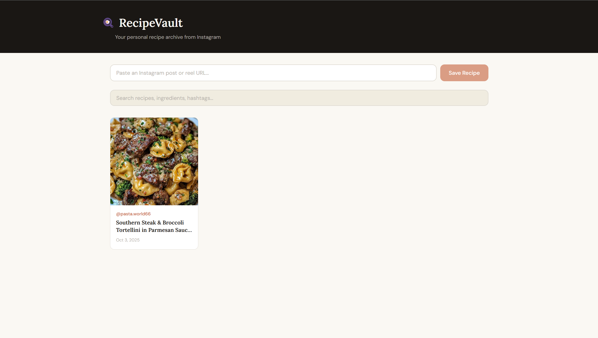

# RecipeVault v1

**Your personal recipe archive from Instagram.**  
Save Instagram recipe posts and reels locally — browse, search, and rewatch them anytime without the algorithm.



---

## Features

- **Save by URL** — Paste any public Instagram post or reel link and save it instantly
- **Video download** — Downloads up to 1080p via yt-dlp, falls back to 720p via instaloader
- **Thumbnail preview** — Cover image pulled automatically from the post
- **Recipe grid** — Browse all saved recipes with author, title, and date
- **Recipe detail** — Full video playback with seeking/scrubbing support and editable instructions
- **Full-text search** — Search by title, caption, ingredients, or hashtags
- **Background processing** — Recipes process in the background while you keep using the app
- **Local storage** — Everything stored locally via SQLite, no cloud required
- **User labels** — Create and assign custom labels to organise recipes (e.g. "quick meals", "weekend")
- **Label filtering** — Filter the recipe grid by label
- **Hashtag management** — Remove unwanted Instagram hashtags individually from the detail page
- **Editable instructions** — Edit the instructions/caption for any saved recipe inline
- **Responsive UI** — Works on desktop and mobile with a warm, cozy theme

## Tech Stack

- **Backend** — FastAPI, Python, SQLite, instaloader, yt-dlp
- **Frontend** — React, Vite

## Running Locally

**Backend**
```bash
cd backend
python -m venv venv
venv\Scripts\activate
pip install -r requirements.txt
uvicorn main:app --reload --port 8000
```

**Frontend**
```bash
cd frontend
npm install
npm run dev
```

Then open [http://localhost:5173](http://localhost:5173) in your browser.

---

## Planned Features

- [x] Tag/hashtag filtering
- [x] Delete recipes from the grid
- [x] User-defined label system
- [x] Label filtering on recipe grid
- [x] Remove individual hashtags
- [x] Editable instructions section
- [x] Video seeking/scrubbing support
- [x] Responsive layout (desktop + mobile)
- [ ] Support for private posts via Instagram login session
- [ ] Export recipes to PDF or notes
- [ ] Video transcription to extract recipe steps (post-hosting, via AWS Transcribe + Claude)
- [ ] Hosting (long-term)
